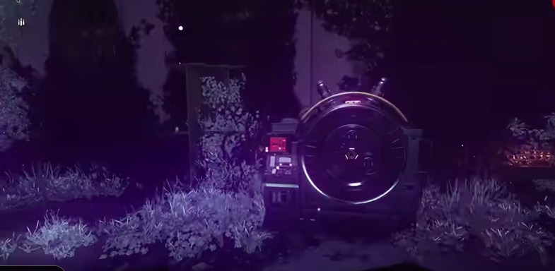
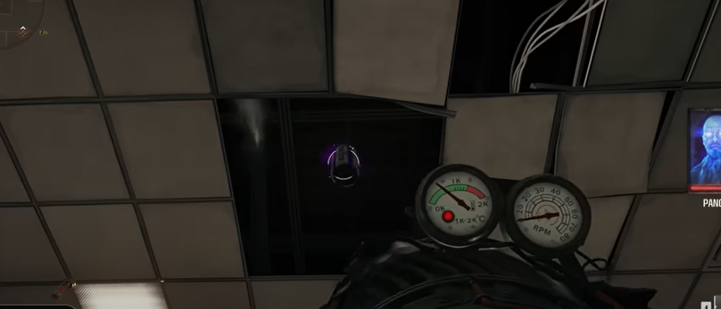
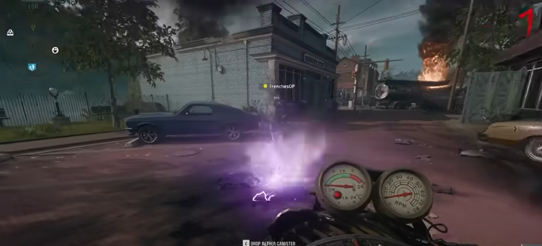
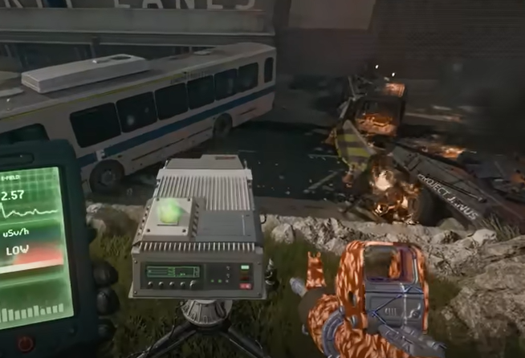
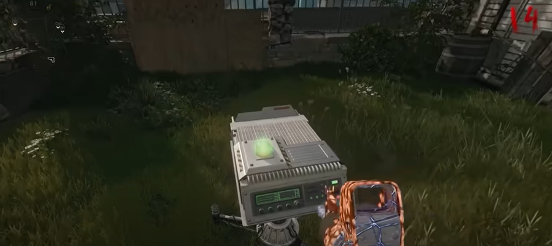
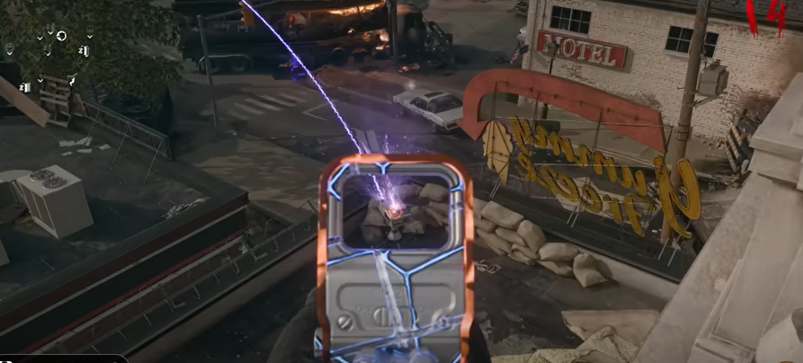

# Liberty Falls Main Quest Guide

## Note:
* Need the Jetgun

## Steps

### Step 1:
Interact with this machine in the church:\
\
\
\

### Step 2:
Using the Jetgun, suck up three items.

#### Item locations:
In the church above the balcony:\
\
\
In the window from on top of the van by Speed cola:\
\
\
In the celing of the comic book store:\
\
\
\
Once you have all three, craft the LTG at the workbench on the roof of the bank.

### Step 3:
Grab an aether cannister from the machine in the church. Place the cannister in spawn in the radius of the trap.\
\
\
\
PLace the LTG here:\
\
\
\
Defend it from zombies, dont let them get close. Once done, a HVT will spawn and you need to get it to very low health. Bring the HVT into the radius of the trap, activate the trap. Kill the HVT while it is stuck in the trap. Bring the cannister back into the church machine.

### Step 4:
Pick up the Strauss counter from the church machine. The counter will display green, yellow, or red color. Find three observation devices, interact with the device to chnage its color to yellow if the counter is yellow, red if the counter is green, or green if the counter is red.

#### Observation device locations:
On the green in front of PHD Flopper:\
\
\
Next to the toolshed and crafting table:\
\
\
On the rooftop of the ice cream shop:\
\
\
\
A beam of purple will connect to a aether cannister in spawn.

### Step 5:
Pick up the aether cannister and put it in the trap's radius. Pick up the LTG and then place it in the graveyard. Repeat step 3's process.

### Step 6:
Prepare for the final fight, bring a mutant injector. Interact with the church machine, this will begin a lockdown in which zombies and specials and elites will attack. Dont forget to use scorestreaks, it should be three waves.

### Step 7:
gg wayyyy too easy
